# Sample lamda typescript tutorial 

Over the course of this tutorial you will be deploying a set of simple todo lamda function, There are three core items we shall be deploying
- Create endpoint
- Get all todo's endpoint
- Get by id todo's endpoint

## What will we be working with 

`AWS Lambda` is a service that lets you run code without provisioning or managing servers. AWS Lambda executes your code only when needed and scales automatically, from a few requests per day to thousands per second. 

`AWS DynamoDB` is a key-value and document database that delivers single-digit millisecond performance at any scale. It’s a fully managed, multiregion, multimaster database with built-in security, backup and restore, and in-memory caching for internet-scale applications.

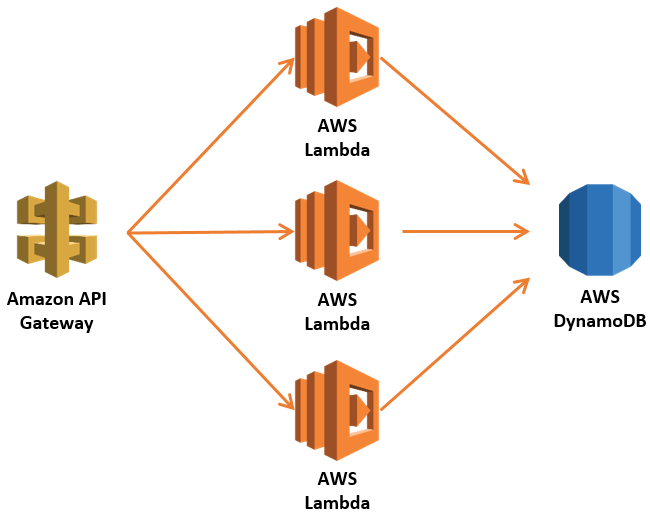

## Step one - Install the serverless framework 

Install the Serverless Framework via npm which was already installed when you installed Node.js.

Open up a terminal and type npm install -g serverless to install Serverless.

```
npm install -g serverless
```

Once the installation process is done you can verify that Serverless is installed successfully by running the following command in your terminal:

```
serverless
```

To see which version of serverless you have installed run:

```
serverless --version
```

## Step two - Install the serverless framework 

Now that you have serverless installed you will need to crate a new set of access credentials, These credentials will be used to push your local project into your AWS account.

Firstly visit, [https://console.aws.amazon.com/](https://console.aws.amazon.com/)

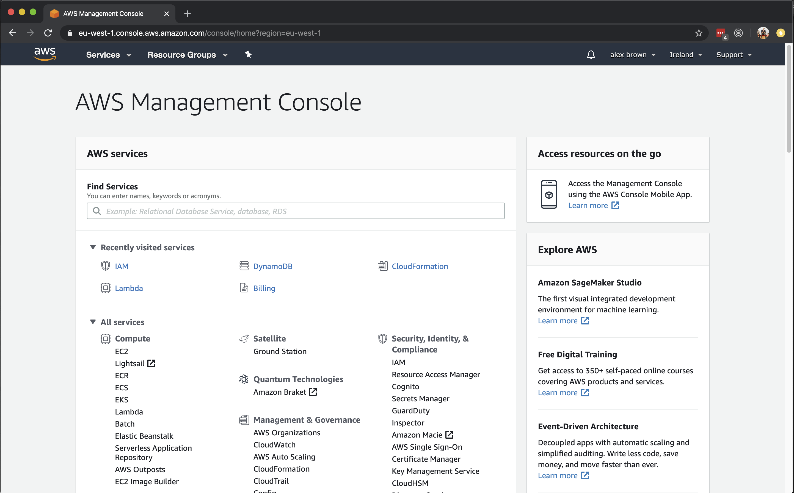

Search for IAM (Identity & access management) 

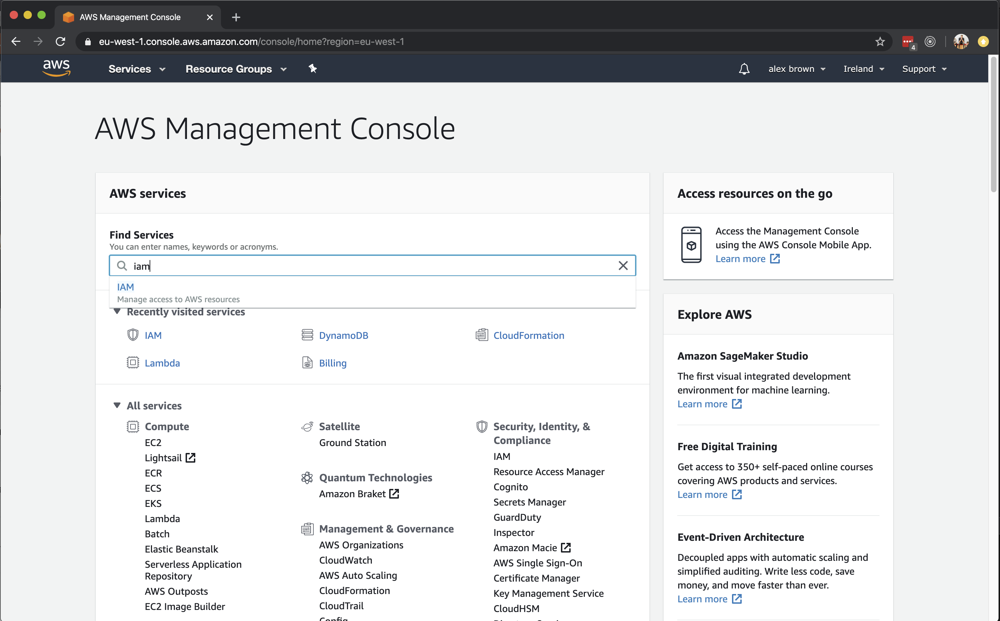

Click on the users link

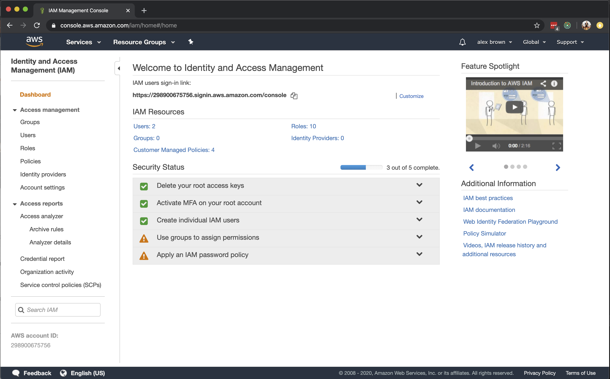

Click on your own user 

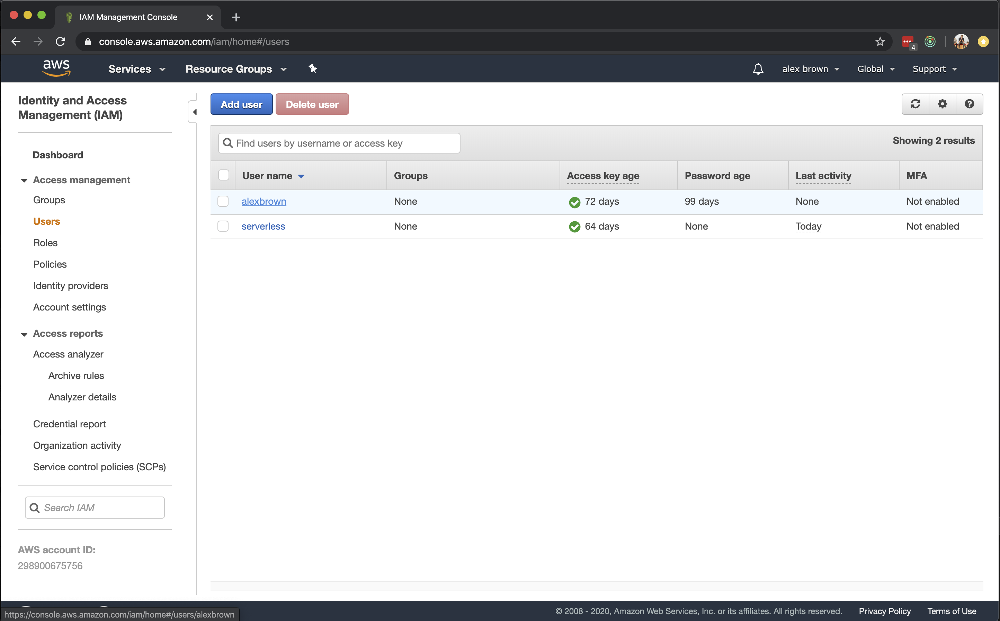

Click on the 'Security credntials' tab

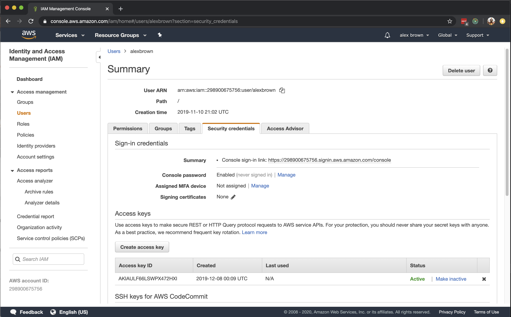

Click on the 'Security credntials' tab and then on 'Create access key'

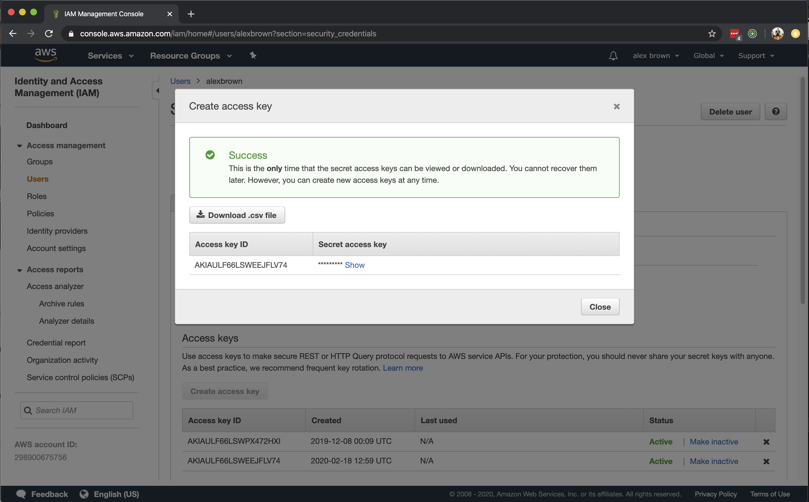

You should now make a copy of both your access key id and secret access key.

Now you have a valid security key you can use to request against your AWS account.


## Step three - Configure your new AWS account profile

Now that you have you acess key and secret you need to add the crential to your local machine as a new profile.

You can simply create a new aws proflile via the command line. For the duration of this tutorial we will be using a profile named 'tutorial'.

```
aws configure --profile tutorial
```

You will then be prompted to enter your access key id and secret.

Also set your aws region to `eu-west-1`

```
└─[$] <> aws configure --profile tutorial
AWS Access Key ID [None]: ****
AWS Secret Access Key [None]: ****
Default region name [None]: eu-west-1
Default output format [None]:
```

CONGRATS, You can now deploy to aws

## Step four - Build and deploy the sample project 

Build and start the lamda locally.x

```
cd packages/ecom-lamda-typescript/
yarn install 
yarn build 
sls offline start
```

This will start the lamda locally, There will be three endpoints started as part of this application.

```
POST /todo
GET /todo
GET /todo/{id}
```

This repo contains a bundled postman collection, You can download this export and import in into your local instance of postman.

It is [Avaliable here](./ref/serverless_local.postman_collection.json)

You can create an new todo item with postman

```
POST
URL
http://localhost:3001/todo

BODY
{
	"text" : "This is the todo text"
}
```

You can request all todo entries 

```
GET
URL
http://localhost:3001/todo
```

You can request a single todo entry.

```
GET
URL
http://localhost:3001/todo/{ID}
```

## Step five - Deploying the serverless application.

Now that you have sucessfully run the lamda function locally you should be able to deploy it to the AWS account you configured in step 3.

We will start by rebuilding the application to ensure that the deployed artifact contains all of the latest updates.

```
yarn build
```

Once you have build the lastest version of the application you can deploy you application via the serverless CLI.

You will need to ensure that you use the `tutorial` profile that you created previously.

```
export AWS_PROFILE="tutorial" && sls deploy
```

If all goes well then the serverless framework will provide you will a list of all of the deployed endpoints and some additional metadata.

```
└─[$] <git:(master)> sls deploy --profile tutorieg
Serverless: Packaging service...
Serverless: Excluding development dependencies...
Serverless: Service files not changed. Skipping deployment...
Service Information
service: sls-typescript-todo-api-with-dynamodb
stage: dev
region: eu-west-1
stack: sls-typescript-todo-api-with-dynamodb-dev
resources: 25
api keys:
  None
endpoints:
  POST - https://2vwe9db8eg.execute-api.eu-west-1.amazonaws.com/dev/todo
  GET - https://2vwe9db8eg.execute-api.eu-west-1.amazonaws.com/dev/todo
  GET - https://2vwe9db8eg.execute-api.eu-west-1.amazonaws.com/dev/todo/{id}
functions:
  create: sls-typescript-todo-api-with-dynamodb-dev-create
  getAll: sls-typescript-todo-api-with-dynamodb-dev-getAll
  getById: sls-typescript-todo-api-with-dynamodb-dev-getById
layers:
  None
Serverless: Run the "serverless" command to setup monitoring, troubleshooting and testing.
```

## Step six - The AWS serverless dashboard.

Now that your serverless functions have been deployed you probably want to start interacting with them ?

Conveniently AWS provides a dashboard for all of their services.

We will start by once again going back to [https://console.aws.amazon.com/](https://console.aws.amazon.com/).

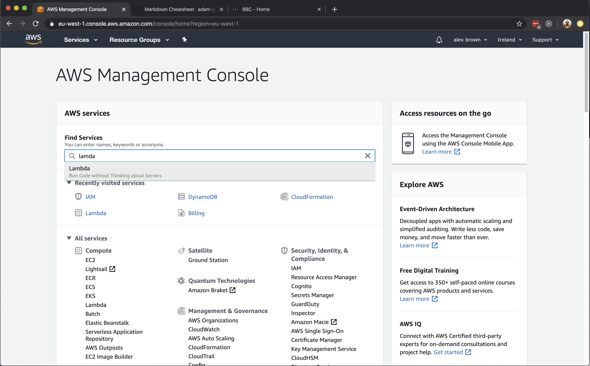

Search for lamda

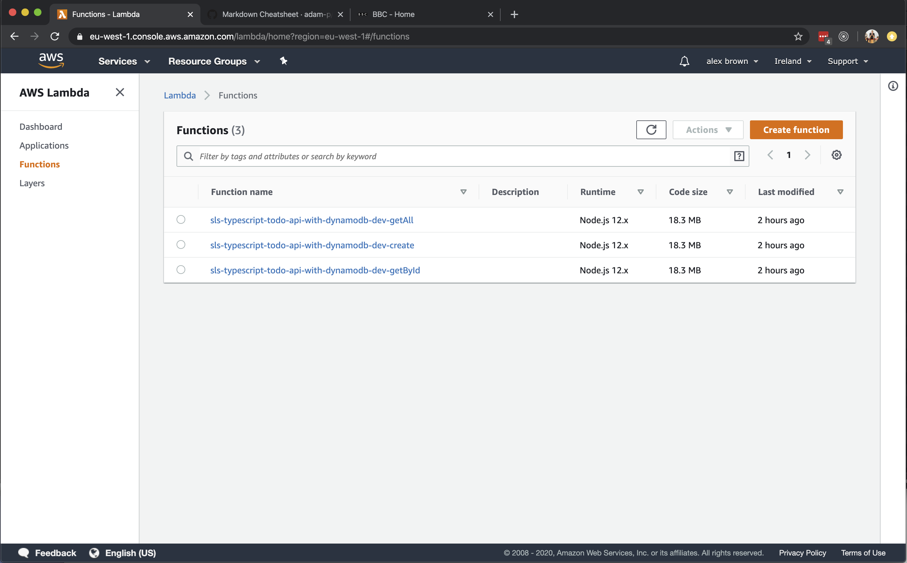

You will now be presented with all of the functions that were deployed as part of the serverless deployment process, For now you will navigate to the `sls-typescript-todo-api-with-dynamodb-dev-create` function.

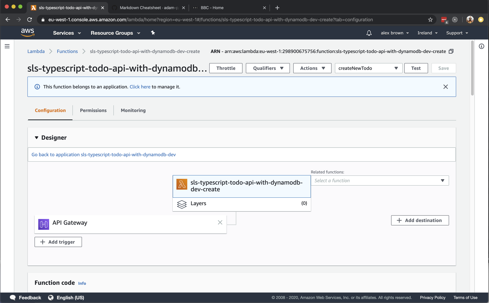

This panel contains of the information relevent to this particular function, When a lamda function is deployed it is assigned a random DNS name that anyone can access to trigger the lamda funcion. All traffic in and out of lamda functions is proxied through `Api Gateway`. 

As such click on the `Api Gateway` asset linked with the `Designer` panel.

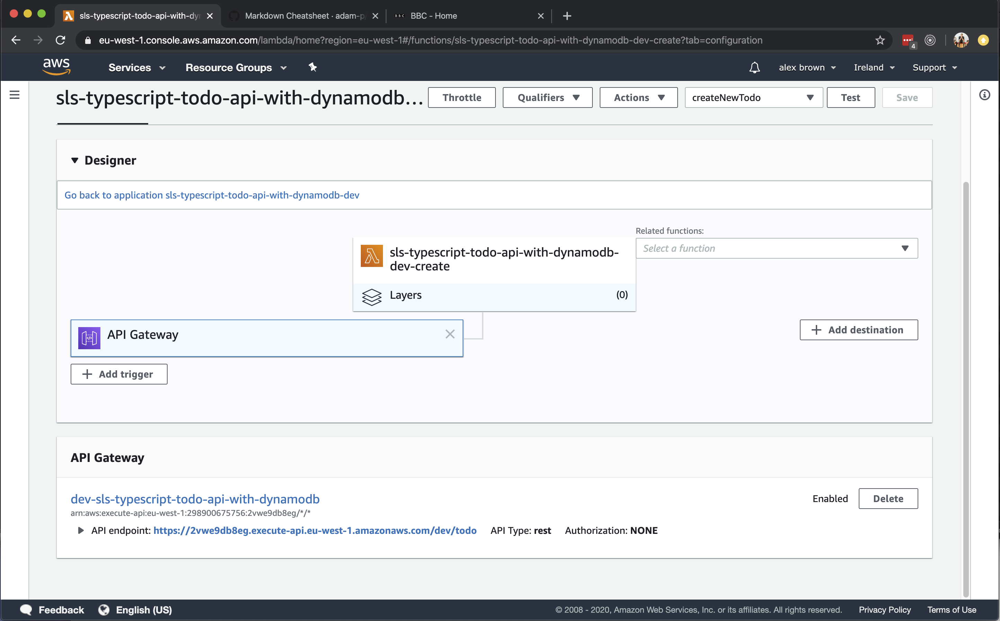

Below the primary designer panel you will now see the `Api Gateway` Metadata.
Here is a public link for the lamda function you have just deployed.

Much like when you ran the lamda locally you can now POST to this endpoint to create a new TODO.

Please note your DNS name will be different.

```
POST
URL
https://2vwe9db8eg.execute-api.eu-west-1.amazonaws.com/dev/todo

BODY
{
	"text" : "This is the todo text"
}
```

## Step seven - But wait where are we storing all of the data

You may be wondering, Where the hell are we saving and fecthing the todo entries.

And the awnser to that is we are storing all of the records in `DynamoDB`, The serverless framework allows you to declare and create `DynamoDb` tables when deploying your serverless functions.

We have declared a basic `DynamoDb` table within a seperate cloudformation file that is imported by the core serverless.yaml file and invoked when deploying the declared application.

The declaration and configuration of a `DynamoDb` table is beyond the scope of this tutorial but you can view the configuration by going to the below file.

```
./packages/ecom-lamda-typescript/serverless-paritals/dynamodb-todo.yaml
```

Much like with the deployed lamda functions you can view, edit and update `DynamoDb` tabled using the AWS console.

We will start by once again going back to [https://console.aws.amazon.com/](https://console.aws.amazon.com/).


Search for dynamodb

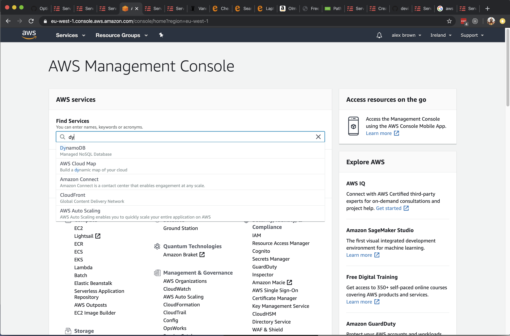

You should now see a list of all of the dynamodb tables that are avaliable to you. You can click on our tutorial table.

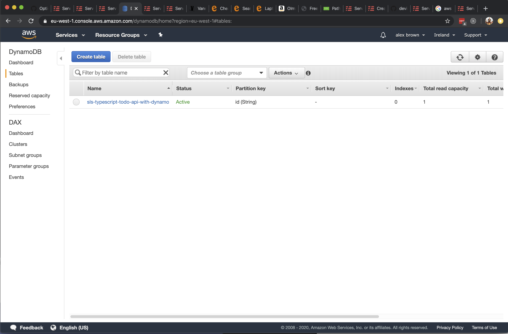

Now you can manage the deployed table, You can query and update all of the record within the database from the `DyanamoDB` table.

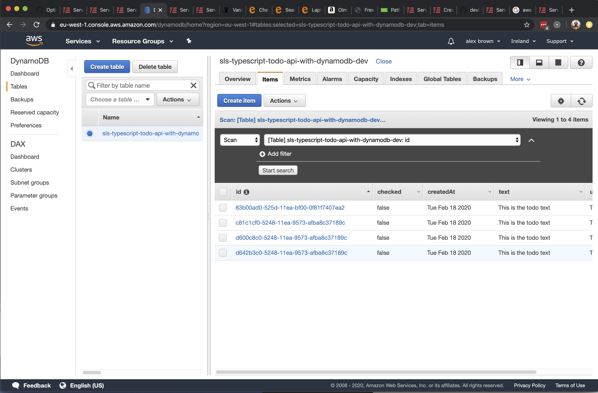